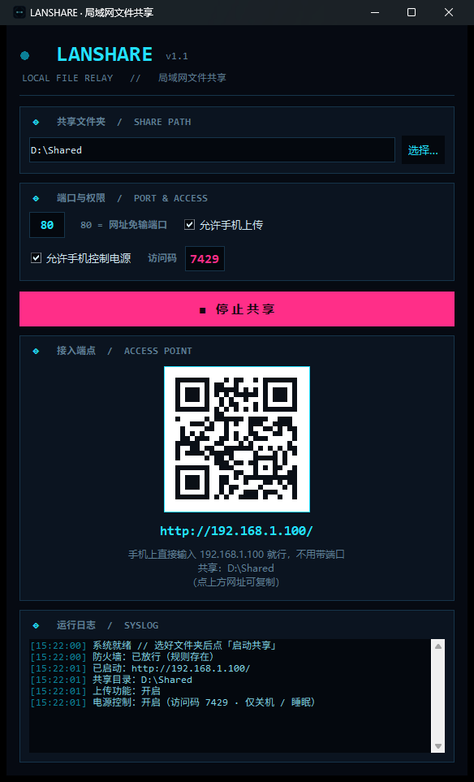

# LanShare · 局域网文件共享

把电脑上的一个文件夹，通过 Wi-Fi 共享给手机、平板或另一台电脑——**手机端零安装，扫码即用**。



单文件 Python 程序，除生成二维码用的 `qrcode` 外没有第三方依赖，不做任何外网穿透，只在你自己的局域网内监听。

---

## 功能

| 功能 | 说明 |
|:--|:--|
| 扫码访问 | 窗口里直接显示二维码，手机扫一下就进来 |
| 网址免端口 | 默认监听 80，手机上直接输 `http://192.168.1.100`，不用打冒号 |
| 浏览与下载 | 目录列表带文件类型图标、大小、修改时间，点开即看 |
| 断点续传 | 支持 HTTP `Range`，手机上拖视频进度条不会失败 |
| 双向传输 | 打开「允许上传」后，手机可多选文件传到电脑，重名自动加序号 |
| 大文件不爆内存 | 上传用 `mmap` + boundary 流式切分，传几个 G 也不会把内存吃满 |
| 路径穿越防护 | 访问共享目录之外的路径一律 403 |
| 深色科幻界面 | 桌面端与手机端共用同一套配色 |
| 手机控制电源 | v1.1 新增：手机远程**关机 / 睡眠**，默认关闭，开启后需输 4 位访问码 |

## 快速开始

### 方式一：下载 exe（推荐，不需要装 Python）

1. 到 [Releases](../../releases) 下载 `LanShare.exe`
2. 放到任意文件夹，双击打开
3. 选一个要共享的文件夹 → 点「启动共享」
4. 手机连上同一个 Wi-Fi，扫窗口里的二维码，或直接输入窗口显示的网址

### 方式二：从源码运行

```bash
pip install qrcode
python LanShare.pyw
```

需要 Python 3.8+。界面在 Windows 上验证最充分，macOS / Linux 也可运行。

## 手机打不开？先放行防火墙

Windows 防火墙默认拦截入站连接，这是最常见的原因。

- 双击 **`fix-firewall.bat`**（会弹 UAC，点「是」），它会放行程序需要的 TCP 端口
- 或手动执行：

```bat
netsh advfirewall firewall add rule name="LanShare File Share (LAN)" dir=in action=allow protocol=TCP localport=80,8080,8888,6666,9999,8000-8100 profile=any enable=yes
```

同时确认两件事：手机和电脑连的是**同一个路由器**（IP 前三段一致），且路由器没有开启「AP 隔离 / 客户端隔离」——开了的话两台设备之间根本无法互访。

## 打包成单文件 exe

双击 **`build.bat`**，产物在 `dist\LanShare.exe`（约 28 MB，自带 Python 运行时，拷走就能用）。

手动打包：

```bash
pip install pyinstaller qrcode
pyinstaller --noconfirm --clean --onefile --noconsole --name LanShare ^
  --icon LanShare.ico --add-data "LanShare.ico;." --hidden-import qrcode LanShare.pyw
```

## 常见问题

| 现象 | 处理 |
|:--|:--|
| 手机打不开网页 | 先按上面放行防火墙；再确认同一网段、路由器未开 AP 隔离 |
| 网址里带 `:8080` 这类端口号 | 说明 80 被别的软件占用了，程序会自动退到备用端口，以窗口显示的地址为准 |
| 换了共享文件夹但内容没变 | 现在的版本是即时生效的，手机刷新一下页面即可；若仍不变请提 issue |
| 想开机自动启动 | 给 exe 建个快捷方式放进启动文件夹（`Win+R` 输入 `shell:startup`），启动参数加 `--autostart` |
| 想改成默认共享某个目录 | 第一次在界面里选好即可，设置会记在 `config.json` 里 |
| 手机点了关机后网页就打不开了 | 正常——电脑都关了，服务自然也不在了。想再唤醒得靠手机 WOL App 或路由器，网页做不到 |
| 点了「睡眠」但感觉像休眠 | 系统启用了休眠时的正常表现，见下一节 |

## 手机远程关机 / 睡眠（v1.1）

电脑端在「端口与权限」面板勾选 **允许手机控制电源**，手机页面右下角就会出现一个电源按钮，点开可以关机或睡眠。开启时会自动生成 4 位访问码，手机端需输入才能操作（可勾选记住）。

**这个开关默认是关的，也建议你只在自家人用的网络里开**——局域网内任何能打开这个网页的设备，只要拿到访问码就能关掉你的电脑。

三件需要知道的事：

- **「睡眠」在你的机器上可能实际是「休眠」。** 只要系统启用了休眠（Windows 默认如此），`SetSuspendState` 就会走休眠——内存写盘、唤醒慢几秒，但断电也不丢数据。这是系统自带行为，程序没有绕开它。
- **这是单向操作。** 电脑一关，服务随之消失，你没办法再用这个网页把电脑唤醒。远程唤醒（Wake-on-LAN）需要发送 UDP 魔术包，浏览器发不出来，而且关机后本机也没有任何服务在跑。想唤觉得靠手机上的 WOL App 或路由器。
- **访问码连错 5 次会锁定 60 秒**，防止有人在局域网里慢慢试。

实现上，电源指令走保留路径 `__power__`，只接受 POST；关机用 `shutdown /s /t 0`，睡眠用 `rundll32 powrprof.dll,SetSuspendState`，两者都**不需要管理员权限**。

## 技术说明

- **HTTP 服务**：标准库 `http.server.ThreadingHTTPServer`，实现 `Range`（206）、流式上传、目录穿越防护
- **界面**：`tkinter` 手绘深色主题（刻意不用 `ttk` 的分隔符与 `LabelFrame`——它们在深色下样式不可控）
- **二维码**：取 `qrcode` 的 `get_matrix()` 直接画到 `tkinter.Canvas` 上，因此**不依赖 Pillow**
- **配置**：`config.json` 与程序同目录，记录共享路径、端口、上传开关、电源控制开关与访问码

### 三个踩过的坑

**1. 隐藏控制台窗口要用 `CREATE_NO_WINDOW`**

程序启动时会用 `netsh` 查防火墙规则。GUI 程序自己没有控制台，用 `subprocess` 拉起控制台子进程时，Windows 会给子进程**新开一个控制台窗口**——用户看到的就是"程序一打开闪一下黑框"。所有外部命令统一走一个 helper：

```python
def run_hidden(cmd, timeout=20):
    kw = {"capture_output": True, "timeout": timeout}
    if os.name == "nt":
        kw["creationflags"] = subprocess.CREATE_NO_WINDOW
    return subprocess.run(cmd, **kw)
```

验收方法（比肉眼看可靠）：启动后查有没有"父进程是本程序的控制台进程"，应当是 0。

```powershell
$pids = @(Get-CimInstance Win32_Process -Filter "Name='LanShare.exe'") | ForEach-Object { $_.ProcessId }
@(Get-CimInstance Win32_Process -Filter "Name='conhost.exe'" |
  Where-Object { $pids -contains $_.ParentProcessId }).Count    # 必须为 0
```

**2. 打包后配置文件路径会漂移**

PyInstaller 的 onefile 模式会把程序解压到 `%TEMP%`，此时 `__file__` 指向临时目录——如果配置按 `__file__` 定位，每次启动都会"忘记"上次的文件夹和端口。要改成跟着可执行文件本身走：

```python
if getattr(sys, "frozen", False):
    APP_DIR = os.path.dirname(os.path.abspath(sys.executable))
else:
    APP_DIR = os.path.dirname(os.path.abspath(__file__))
```

**3. 没读完请求体就返回，会让下一个请求莫名 501**

HTTP/1.1 是 keep-alive 的，一个 TCP 连接会连着跑好几个请求。如果服务端在某个分支提前返回（比如「这个功能没开放」直接 403）而请求体还没读，那些字节就会赖在 socket 里，把下一个请求的报文头顶歪——对端收到畸形的请求行，标准库只能回 `501 Not Implemented`。

这个 bug 单发一次请求测不出来，必须复用同一个连接连发三次：

```python
c = http.client.HTTPConnection("127.0.0.1", port)
for _ in range(3):
    c.request("POST", "/__power__", body="action=x&pin=1",
              headers={"Content-Type": "application/x-www-form-urlencoded"})
    print(c.getresponse().status)   # 三次必须一致
```

规矩很简单：**先把 `Content-Length` 指定的字节读干净，再做任何判断。**

## 许可

[MIT](LICENSE)
